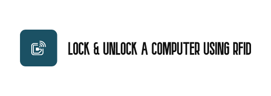
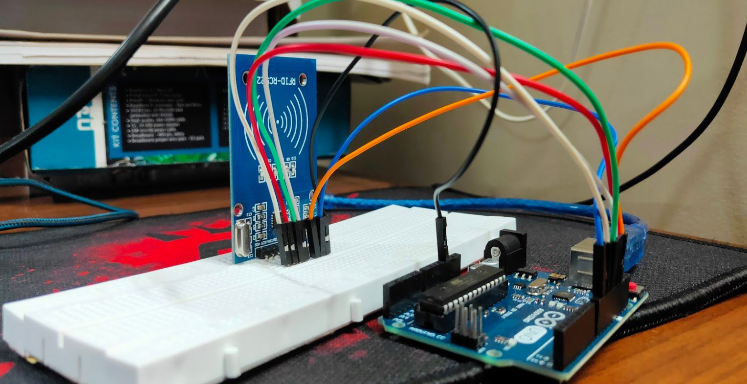
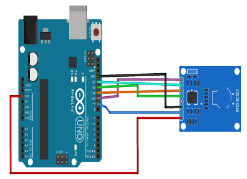
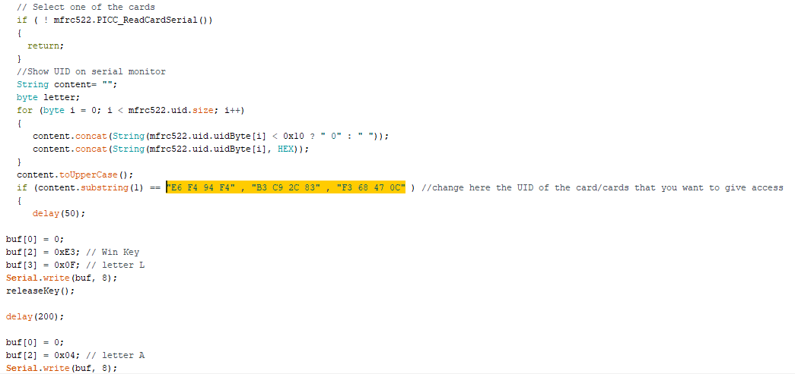
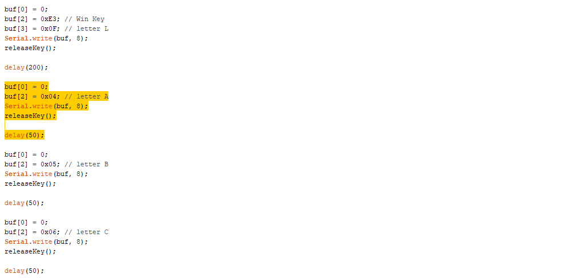
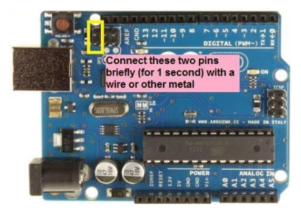

# Lock_Unlock_A_Computer_Using_RFID

    
     An Arduino Project that allows you to lock and unlock any computer with the help of an RFID Reader.

---

## Table of Contents

- [Motivation](#Motivation)
- [Installation](#Installation)
- [Usage](#Usage)
  - [Component Identification](#Step-1-Component-Identification)
    - [Hardware](#Hardware-used-in-this-project)
    - [Software](#Software-used-in-this-project)
  - [Connections](#Step-2-Connections)
  - [Changing the Code](#Step-3-Changing-The-Code)
  - [Upgrading Firmware](#Step-4-Upgrading-the-Firmware-of-Atmega16U2-on-Board)
  - [Testing](#Step-5-Testing)
- [Contributing](#Contributing)
- [License](#License)

## Motivation

A project built to reduce the time it takes to manually type a password, and allows users to use complex passwords without the worry about forgetting it.

This was an university project that helped me learn the basics of Arduino and C.

    

## Installation

This project uses `Arduino UNO` and hence utilizes <a href="https://www.arduino.cc/en/Main/Software">Arduino IDE</a> to upload the code onto the Board.

Ensure that you have the latest version of the Arduino IDE installed.

In order to upgrade the Firmware of `Atmega16U2` on Board, we use
`Atmel Flip 3.4.7`. Click here to <a href="http://ww1.microchip.com/downloads/en/DeviceDoc/JRE%20-%20Flip%20Installer%20-%203.4.7.112.exe">Download</a> the software.

Download the latest version of this project from <a href="https://github.com/Sabareesh000/Lock_Unlock_A_Computer_Using_RFID/releases">Releases</a>.
As an alternative, you can also clone this repository using

<pre>
git clone https://github.com/Sabareesh000/Lock_Unlock_A_Computer_Using_RFID.git
</pre>

## Usage

The first step is to understand the various components used in this project.

### Step 1: Component Identification

#### Hardware used in this project:

1. Arduino Uno
2. RFID Scanner
3. RFID tags
4. Jumper wires
5. Breadboard

#### Software used in this project:

1. <a href="https://www.arduino.cc/en/Main/Software">Arduino IDE</a>
2. <a href="http://ww1.microchip.com/downloads/en/DeviceDoc/JRE%20-%20Flip%20Installer%20-%203.4.7.112.exe">Atmel Flip 3.4.7</a>

Once, you have all the components required for the project, the next step would
be to make the connections.

### Step 2: Connections

**NOTE:** Make the Connections **exactly** as given below; else, you would have to
modify the code.

| Pin  | Wiring to Arduino UNO |
| ---- | --------------------- |
| SDA  | Digital 10            |
| SCK  | Digital 13            |
| MOSI | Digital 11            |
| MISO | Digital 12            |
| IRQ  | Unconnected           |
| GND  | GND                   |
| RST  | Digital 9             |
| 3.3V | 3.3V                  |

    
     Connections

Once, the connections are made, you are ready to get started with the software
part of the project.

### Step 3: Changing The Code

Firstly, make sure you add `MFRC522` Library to Arduino IDE

To do this, click on this <a href="https://github.com/miguelbalboa/rfid">Link</a>.

Download and Extract the repository(library) into the libraries folder in Arduino Sketch Folder.

If you don’t know where the Arduino Sketch Folder is, Don’t worry. Follow the
steps given below.

1. Launch Arduino IDE.
2. Click on files and then go to preferences.
3. You should be able to find your Sketchbook location here.
4. Now, navigate to this folder using Windows Explorer.
5. If there is no `Libraries` folder there, create one.
6. Extract the downloaded MFRC522 Library inside this folder.

Once you are done adding the library, you are all set up for editing the code.

The first change you have to do is modify your `UID number`.

The Line Highlighted is the UID of my RFID tags. Remove them and add your UID

Once you are done modifying the UID, Its time for you to change the `keystrokes`.

Keystrokes are the keyboard strokes you make to enter your computer password,
in other words the keys you press to enter your computer password. So first, you convert your computer
password into keyboard strokes using the <a href="https://github.com/Sabareesh000/Lock_Unlock_A_Computer_Using_RFID/blob/master/USBKeyScan.pdf">USBKeyScan.pdf</a> I’ve added in the
repository.

By Default, my code is set to type ABCD as the keystroke(I had set my computer
password as ABCD).

To set up your password,
you have to edit the highlighted code. Don’t change anything, just go to

<pre>
buf[2] = 0x04; 
</pre>

and change **04** into the keystroke number of
the first letter of your password using the <a href="https://github.com/Sabareesh000/Lock_Unlock_A_Computer_Using_RFID/blob/master/USBKeyScan.pdf">USBKeyScan.pdf</a>.

Similarly modify the next `buf[2] = 0x05` to the second letter of your password.

If you want to add more letters, just copy the template of the code and paste it and modify the
key scan numbers into that of your password.

**NOTE:** Make sure you copy the `delay(50);` as well

Finally, after modification, upload the code to Arduino Uno by selecting the
correct `port` and correct `COM port`.

Once you are done with uploading the code, it is time for you to update the
Firmware of Arduino in order to change it into a keyboard. So that it can enter
your password when locked or press Win+L to lock the computer.

### Step 4: Upgrading the Firmware of Atmega16U2 on Board

If you haven't installed <a href="http://ww1.microchip.com/downloads/en/DeviceDoc/JRE%20-%20Flip%20Installer%20-%203.4.7.112.exe">Atmel Flip 3.4.7</a> yet, do it now.

Firmware files that are used are present within this repository.

    

Now, follow the steps given below:

1. Place a jumper on reset and ground and remove it like in the picture
2. Open Atmel Flip and select the firmware file `Arduino-Keyboard-0.3.hex`.
   &nbsp;&nbsp;&nbsp;&nbsp;&nbsp;&nbsp;&nbsp;&nbsp;&nbsp;&nbsp;From File Tab -> Load Hex File
3. Select Run.
4. Remove USB and plug it again.

**NOTE:** if there was an error in the code and you want to update it and upload it
again into your Arduino, you might notice that your Arduino does not show up on
your `COM ports`. Don’t worry, this happens because you have updated the
firmware of your Arduino. All you have to do is, repeat the above step but instead
of selecting `Arduino-Keyboard-0.3.hex` you have to select the `Arduino-usbserial-uno.hex` file and repeat the steps again. Now when you connect, your
device will be recognised as Arduino Uno.

Once you are done with updating the firmware, it is time to test your hardware.

### Step 5: Testing

Connect your Arduino to the computer and slowly move your RFID tag towards
your RFID scanner.

If your computer were in the unlocked state, the Arduino would press Win+L and
send it to a locked state. Withdraw your RFID Tag.

If your computer were in the locked state, the Arduino would enter your
password based on the keystrokes you have entered in the code and then presses
enter to unlock your computer. Withdraw your RFID Tag.

This Concludes all the steps required to create this project. To understand various
components and working principle behind it. Read the Documentation present in
the folder.

## Demo

    

